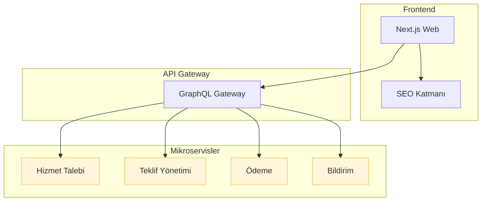

# OnlineUsta.com.tr

Profesyonel hizmet sağlayıcılar ile müşterileri buluşturan modern bir pazar yeri platformu. Armut.com benzeri, ancak daha hızlı, daha güvenli ve SEO dostu olacak şekilde tasarlanmıştır.

## 🚀 Proje Vizyonu

1. **Kullanıcı Dostu**: Basit, anlaşılır ve duyarlı arayüz.
2. **Mükemmel SEO**: SSR + SSG kombinasyonu, yapılandırılmış veri, hızlı sayfa yükleme.
3. **Performans**: Lighthouse 90+; resim optimizasyonu, kode bölme (code-splitting).
4. **Güvenlik**: OWASP Top-10 uyumlu, 2FA, rate-limiting.
5. **Ölçeklenebilirlik**: Mikroservis mimarisi, bulut-native altyapı.

## 🔧 Teknoloji Yığını

| Katman | Teknoloji |
| ------ | --------- |
| Frontend | Next.js 14 (App Router) + TypeScript, TailwindCSS, Zustand, TanStack Query |
| Backend | NestJS + TypeScript, GraphQL & REST Hybrid, CQRS |
| Veri Tabanı | PostgreSQL (RDS) + Prisma ORM |
| Arama | Elasticsearch (OpenSearch) |
| Mesaj Kuyruğu | NATS JetStream |
| CDN  & Depolama | AWS CloudFront, S3 |
| Kimlik Yönetimi | Keycloak (OIDC) |
| CI/CD | GitHub Actions ➜ Docker ➜ AWS EKS |
| Gözlemlenebilirlik | OpenTelemetry, Grafana, Loki |

## 🏗️ Mimarî Genel Bakış



## 📂 Proje Dizin Yapısı (Monorepo: Turborepo)

```
.
├─ apps/
│  ├─ web/           # Next.js frontend
│  └─ api-gateway/   # GraphQL Gateway
├─ packages/
│  ├─ ui/            # Paylaşılan tasarım sistemi bileşenleri
│  └─ config/        # ESLint, Prettier, tsconfig ayarları
├─ services/
│  ├─ request/       # Hizmet talebi mikroservisi
│  ├─ offer/         # Teklif yönetimi mikroservisi
│  ├─ payment/       # Ödeme mikroservisi
│  └─ notification/  # E-posta ve push
└─ infra/            # Terraform & Helm chart'lar
```

## 🖇️ Kurulum

1. Depoyu klonlayın:
   ```bash
   git clone git@github.com:onlineusta/onlineusta.com.tr.git
   cd onlineusta.com.tr
   ```
2. Bağımlılıkları yükleyin (pnpm tercih edilir):
   ```bash
   corepack enable
   pnpm install
   ```
3. Environment dosyasını oluşturun:
   ```bash
   cp env.example .env.local
   # Gerekli environment değişkenlerini doldurun
   ```
4. Husky git hooks'ları kurun:
   ```bash
   pnpm prepare
   ```
5. Geliştirme ortamını başlatın:
   ```bash
   pnpm dev
   ```
6. Test komutları:
   ```bash
   pnpm lint        # Linting
   pnpm test        # Unit testleri
   pnpm build       # Production build
   ```

## 🚢 Dağıtım

EKS üzerine GitHub Actions ile otomatik dağıtım yapılır. PR merge edildiğinde:
1. Unit & e2e testleri çalışır.
2. Docker imajları build & push.
3. Helm chart versiyonu güncellenir.
4. `kubectl rollout` ile sürüm canlıya alınır.

## 🔍 SEO Stratejisi

- Server-Side Rendering + Static Generation
- JSON-LD ile yapılandırılmış veri (Product, Service)
- Meta tag ve OpenGraph optimizasyonu
- `robots.txt`, `sitemap.xml` otomatik oluşturma
- Core Web Vitals takibi (Next.js Analytics)

## 🤝 Katkı Sağlama

1. Fork ➜ Branch (`feature/xyz`) ➜ PR
2. Conventional Commits (`feat:`, `fix:` ...)
3. Tüm testler yeşil olmalı.
4. En az 1 reviewer onayı.

## 📝 Lisans

GPL-3.0

---
**OnlineUsta.com.tr** © 2024 